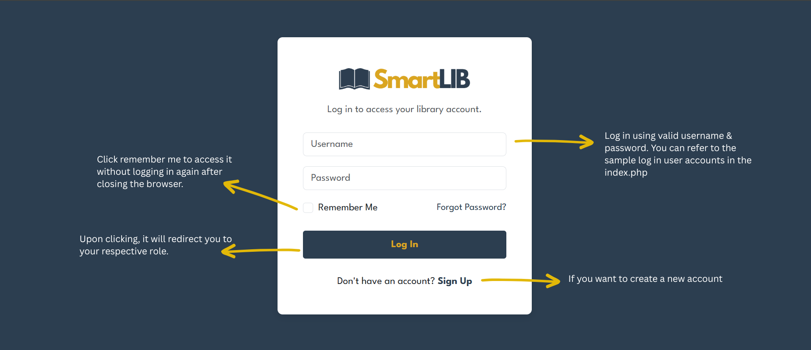
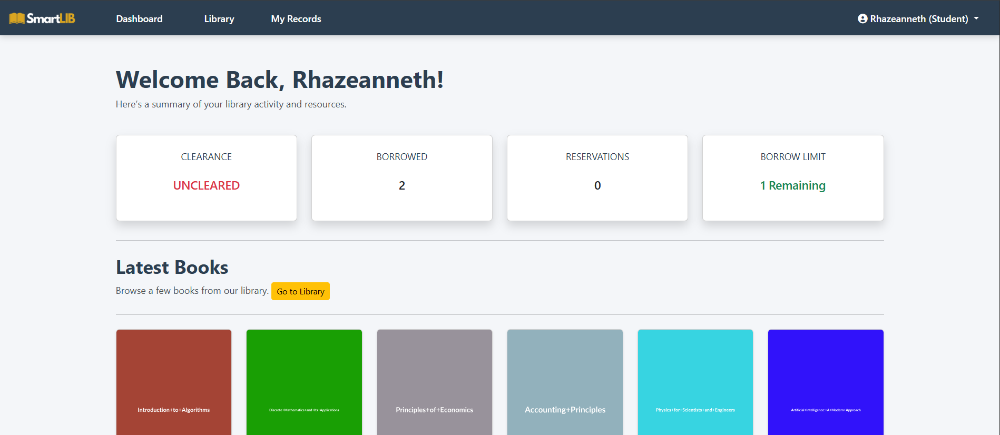
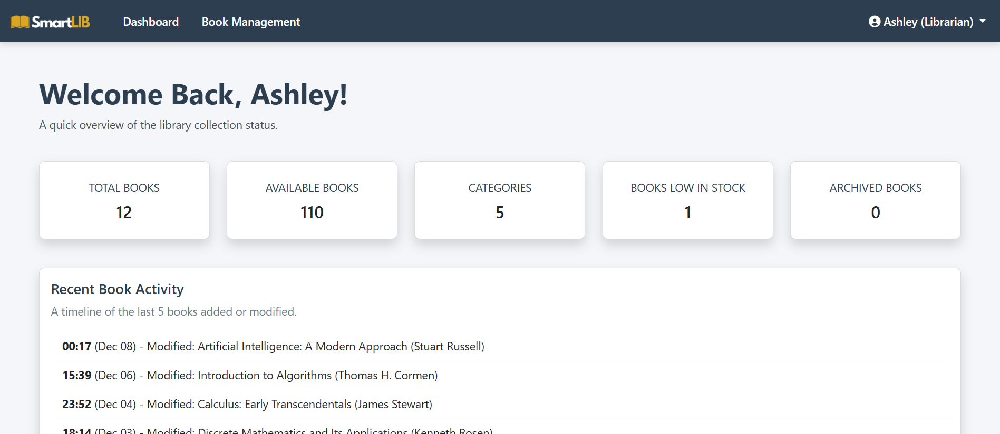
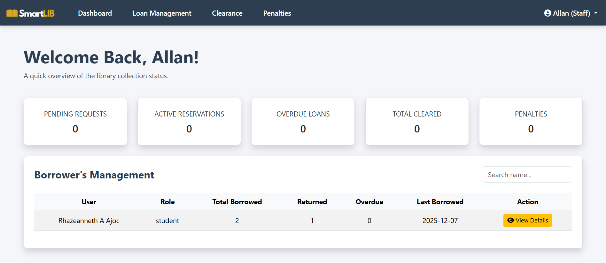

# 📘 SmartLIB – User Guide
### Welcome to SmartLIB Library Management System
This guide provides simple, step-by-step instructions for each user role: Student, Teacher, Staff, and Librarian.

---

## 🔐 Logging In
1. Open any web browser (Chrome, Edge, etc.).
2. In the address bar, go to: **http://localhost/library-system**
3. You will be taken to the **Login Page**:

4. Enter your **Username** and **Password**.
5. Click **Login** to continue to your dashboard.

### ✔ Notes
- Ensure your credentials are correct.
- If login fails, an error message will appear.
- Sample accounts are available in `index.php`.

---

## 📝 Signing Up
1. From the Login Page, click **Sign Up**.
2. Complete the registration form:

3. Fill out all required fields, including username and password.
4. Review your information and click **Complete Sign Up**.
5. You will be redirected to the login page upon successful registration.

### ✔ Notes
- All fields are required.
- Password and Confirm Password must match.
- Duplicate usernames are not allowed.
- Each role has different access levels once logged in.

---

## 👩‍🎓 Student & Teacher Pages
Navigate the **Top Menu** to access the pages.

### 1. Dashboard
The **Dashboard** provides a summary of your library activity:

- **Latest Books**: Displays recently added books.
  - Click **Borrow** or **Reserve** to request a book.
  - Buttons will be **disabled** if you have reached your borrowing limit.
- **Browse Library**:
  - Click the **“Go to Library”** button in Latest Books or use the **Top Menu** to access the full library catalog.
- **Top Menu User Dropdown**:
  - Click your **name** to see options:
    - **Profile** – View your profile
    - **Settings** – Update account details
    - **Logout** – Sign out

Successful requests show a **confirmation message**; failed requests display an **error message**.

---

### 2. Library Catalog
The **Library Catalog** allows browsing and searching:

- **Search Bar**: Filter books by title, author, or category.
- **Book Cards**: Each book displays:
  - Title, author, description, category
  - **Borrow** and **Reserve** buttons:
    - Disabled if the borrowing limit is reached
    - Show success or error messages based on action

---

### 3. Teacher Exclusive Page
Teachers have an additional **Exclusive Books** page:

- Layout and navigation match the Library Catalog.
- Displays books intended only for teachers.
- Borrowing and reserving functions work the same way.

---

### 4. My Records
The **My Records** page tracks user activity:

- **Borrowed**: Books approved by staff.
  - **Sem 1** – Accessible by default.
  - **Sem 2** – Locked until staff approval via clearance.
- **Book Requests Tab**: Track pending borrow requests.
- **Reservations Tab**: View reserved books and pickup status.

---

# 🧑‍💼 Librarian Pages
Librarian access via the **Top Menu**:

1. **Dashboard**  
2. **Book Management**

---

## 1. Dashboard
Provides a quick overview of library collection:

- **Library Collection Status**: Total books, available books, categories, other statistics.
- **Recent Activities**: Last 5 book activities (modifications or new additions).

---

## 2. Book Management
Allows managing all books:

- **Books Table**:
  - **Edit (Blue)** – Modify book metadata.
  - **Archive (Red)** – Archive a book; changes to **Restore** when archived.
- **Top Right Buttons**:
  - **Add Book** – Opens a modal to add a new book.
  - **Category Management** – Add, edit, or delete categories. System ensures category is empty before deletion.

Designed for **efficient and simple navigation**.

---

# 🧑‍💼 Staff Pages
Staff has four links in the **Top Menu**:

1. **Dashboard**  
2. **Loan Management**  
3. **Clearance**  
4. **Penalties**

---

## 1. Dashboard
Provides a quick overview of transactions:

- **Report Cards**: Shows pending requests, active reservations, overdue loans, total clearances.
- **Borrower Management Table**:
  - Lists all users.
  - **View Details** – See user history of borrowed, returned, and reserved books.

---

## 2. Loan Management
Tabbed table with sidebar navigation:

1. **Borrow Requests** – Approve or reject users’ borrow requests.
2. **Reservation Requests** – Manage pending reservations.
3. **Return Management** – Confirm physical book returns.
4. **Reservation Pickups** – Confirm user pickup of reserved books.

---

## 3. Clearance
Shows users separated by role:

- **Clear Button** – Disabled if unreturned books, overdue items, or pending penalties exist. Only mark users cleared when all conditions are met.
- **Set Penalties Button** – Manual trigger; staff must follow rules before applying penalties.

---

## 4. Penalties
Handles overdue fines after clearance week:

- Populated with users who did not return books post-clearance.
- Students must pay penalties to be cleared.
- Approved penalties automatically update clearance status in the **Clearance** page, reducing manual effort.
